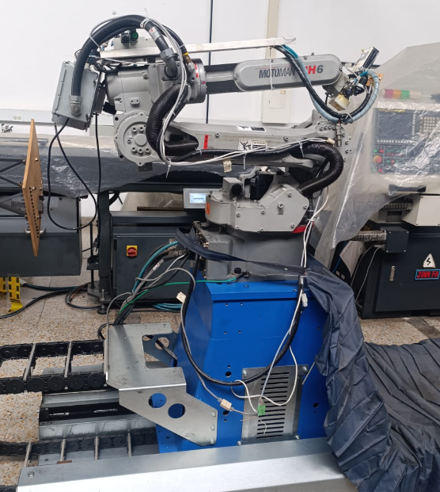
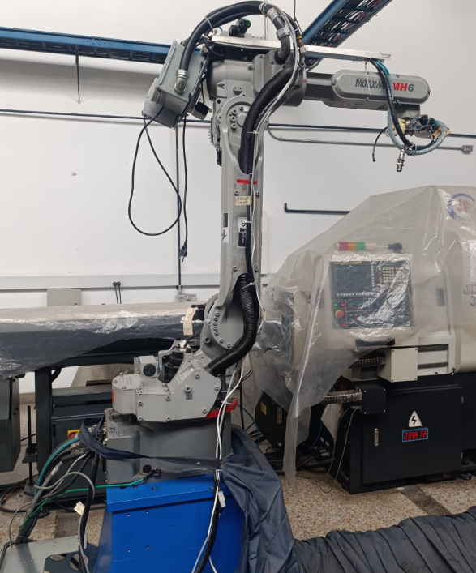
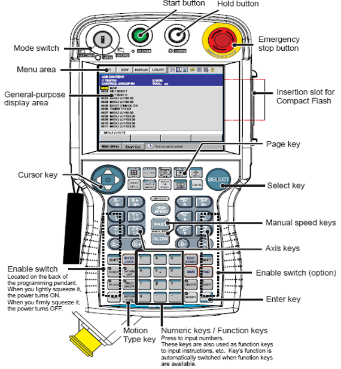
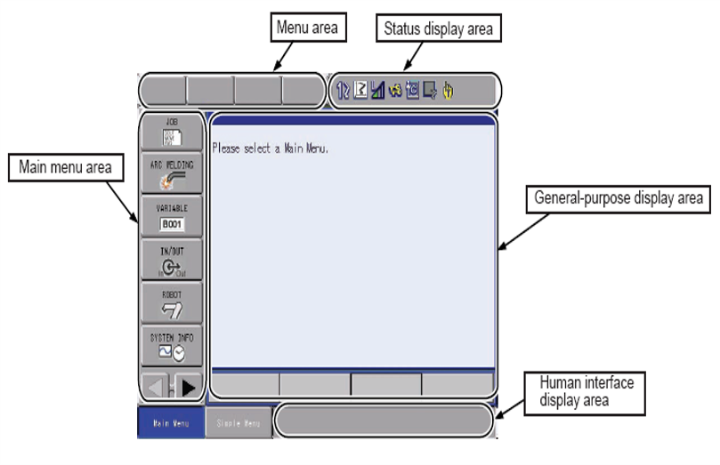
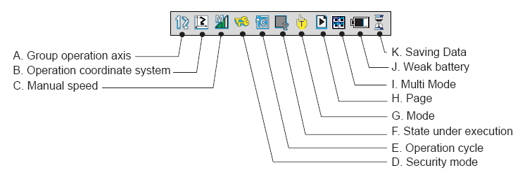

# Laboratorio No. 02 — Robótica Industrial
### Análisis y Operación del Manipulador Motoman MH6.
**Universidad Nacional de Colombia · Robótica 2026-I**

---

## Integrantes

| Nombre | URL del Repositorio |
|--------|-------------------|
| Julian Benitez | https://github.com/JulianI3 |
| Juan Salamanca | https://github.com/JuanSalan |

---

## Descripción de la Solución

En este laboratorio se trabajó en una breve caracterización de operación del robot manipulador Motoman MH6 programado mediante el software RoboDK. A partir de código desarrollado en lenguaje Python, se le ordenó al manipulador, tanto en el entorno virtual como físico, la ejecución de trayectorias correspondientes a la escritura de los nombres de los integrantes del equipo y al trazado de una figura en coordenadas polares. Adicionalmente, se estudiaron aspectos básicos de operación manual, configuraciones iniciales y control de movimiento del manipulador.

---
## Tabla comparativa de especificaciones entre robot manipulador Motoman MH6 y IRB 140

La siguiente tabla muestra las características técnicas de los 2 Robots manipuladores utilizados en los últimos laboratorios
<table align="center">
  <tr>
    <th align="center">Característica</th>
    <th align="center">Motoman MH6</th>
    <th align="center">IRB 140</th>
  </tr>

  <tr>
    <td align="center">Fabricante</td>
    <td align="center">Yaskawa Motoman</td>
    <td align="center">ABB</td>
  </tr>

  <tr>
    <td align="center">Controlador</td>
    <td align="center">DX100</td>
    <td align="center">IRC5</td>
  </tr>

  <tr>
    <td align="center">Carga útil</td>
    <td align="center">6 kg</td>
    <td align="center">6 kg</td>
  </tr>

  <tr>
    <td align="center">Alcance</td>
    <td align="center">1422 mm</td>
    <td align="center">800 mm</td>
  </tr>

  <tr>
    <td align="center">Número de grados de libertad</td>
    <td align="center">6</td>
    <td align="center">6</td>
  </tr>

  <tr>
    <td align="center">Peso</td>
    <td align="center">130 kg</td>
    <td align="center">98 kg</td>
  </tr>

  <tr>
    <td align="center">Repetibilidad</td>
    <td align="center">±0,08 mm</td>
    <td align="center">±0,08 mm</td>
  </tr>

  <tr>
    <td align="center">Velocidad eje S / A</td>
    <td align="center">140 °/sec</td>
    <td align="center">200 °/sec</td>
  </tr>

  <tr>
    <td align="center">Velocidad eje L / B</td>
    <td align="center">130 °/sec</td>
    <td align="center">200 °/sec</td>
  </tr>

  <tr>
    <td align="center">Velocidad eje U / C</td>
    <td align="center">135 °/sec</td>
    <td align="center">260 °/sec</td>
  </tr>

  <tr>
    <td align="center">Velocidad eje R / D</td>
    <td align="center">270 °/sec</td>
    <td align="center">360 °/sec</td>
  </tr>

  <tr>
    <td align="center">Velocidad eje B / E</td>
    <td align="center">270 °/sec</td>
    <td align="center">360 °/sec</td>
  </tr>

  <tr>
    <td align="center">Velocidad eje T / F</td>
    <td align="center">400 °/sec</td>
    <td align="center">450 °/sec</td>
  </tr>

  <tr>
    <td align="center">Aplicaciones típicas</td>
    <td align="center">Soldadura por arco, corte y manipulación de materiales</td>
    <td align="center">Ensamblaje de precisión, pick and place y educación</td>
  </tr>
</table>
<div align="center">

<table>
<tr>
<td align="center">

<br>
<b>(a)</b> Notación de ejes para el manipulador Motoman MH6
</td>

<td align="center">

<br>
<b>(b)</b> Notación de ejes para el manipulador IRB 140
</td>

</tr>
</table>

</div>

---

## Descripción de las 2 posiciones de Home del manipulador Motoman MH6

La configuración Home 1 del Motoman MH6 corresponde a una postura “guardada” o recogida del manipulador, en la cual el brazo permanece agachado y compacto. Esta posición se utiliza normalmente al finalizar una rutina o cuando el robot se encuentra fuera de operación, ya que reduce el espacio ocupado y disminuye el riesgo de interferencias en el área de trabajo.

Los valores de la posición Home 1 de cada una de las 6 articulaciones del Motoman MH6 se muestran a continuación.

<table align="center">
  <tr>
    <th align="center">Eje</th>
    <th align="center">Origin</th>
    <th align="center">Current</th>
  </tr>

  <tr>
    <td align="center">S</td>
    <td align="center">0</td>
    <td align="center">0</td>
  </tr>

  <tr>
    <td align="center">L</td>
    <td align="center">-115290</td>
    <td align="center">-115291</td>
  </tr>

  <tr>
    <td align="center">U</td>
    <td align="center">-111622</td>
    <td align="center">-111623</td>
  </tr>

  <tr>
    <td align="center">R</td>
    <td align="center">1</td>
    <td align="center">1</td>
  </tr>

  <tr>
    <td align="center">B</td>
    <td align="center">42647</td>
    <td align="center">42648</td>
  </tr>

  <tr>
    <td align="center">T</td>
    <td align="center">1392</td>
    <td align="center">1392</td>
  </tr>
</table>

Por otro lado, la configuración Home 2 corresponde a una postura vertical, donde el manipulador queda elevado y con mayor libertad de movimiento. Esta posición se emplea antes de montar piezas o realizar tareas de manipulación, facilitando el desplazamiento manual y el acceso al espacio de trabajo del robot.
Los valores de la posición Home 2 de cada una de las 6 articulaciones del Motoman MH6 se muestran a continuación.
<table align="center">
  <tr>
    <th align="center">Eje</th>
    <th align="center">Specified</th>
    <th align="center">Current</th>
    <th align="center">Difference</th>
  </tr>

  <tr>
    <td align="center">S</td>
    <td align="center">0</td>
    <td align="center">0</td>
    <td align="center">0</td>
  </tr>

  <tr>
    <td align="center">L</td>
    <td align="center">2037</td>
    <td align="center">2037</td>
    <td align="center">0</td>
  </tr>

  <tr>
    <td align="center">U</td>
    <td align="center">2359</td>
    <td align="center">2359</td>
    <td align="center">0</td>
  </tr>

  <tr>
    <td align="center">R</td>
    <td align="center">0</td>
    <td align="center">0</td>
    <td align="center">0</td>
  </tr>

  <tr>
    <td align="center">B</td>
    <td align="center">-121</td>
    <td align="center">-121</td>
    <td align="center">0</td>
  </tr>

  <tr>
    <td align="center">T</td>
    <td align="center">1392</td>
    <td align="center">1392</td>
    <td align="center">0</td>
  </tr>
</table>

<div align="center">

<table>
<tr>
<td align="center">

<br>
<b>(a)</b> Posición Home 1
</td>

<td align="center">

<br>
<b>(b)</b> Posición Home 2
</td>

</tr>
</table>

</div>

## Movimientos manuales: modos de operación, traslaciones y rotaciones

### Encendido y preparación

Antes de cualquier movimiento manual se debe seguir la siguiente secuencia:

1. Verificar que el área de trabajo esté **completamente despejada** y que ninguna persona se encuentre dentro del radio de acción del robot.
2. Encender el **interruptor principal** del controlador DX100.
3. Esperar a que el sistema cargue completamente. El teach pendant mostrará el menú principal.
4. Verificar que no haya **alarmas activas**. Si existen, resolverlas antes de continuar.
5. Confirmar el estado inicial: servos en `SERVO OFF`, modo `TEACH`, velocidad de jog en nivel mínimo.

Todos los botones que son mencionados en estos procedimientos se pueden observar en la siguiente imagen



### Activación del modo TEACH y habilitación de servos

El modo **TEACH** es el único en que se pueden realizar movimientos manuales mediante el teach pendant.

**Activar modo TEACH:**

1. Localizar la **llave selectora de modo** en el teach pendant del DX100.
2. Girar la llave a la posición **`TEACH`**.
3. La pantalla confirmará el cambio mostrando `TEACH MODE`.

> En modo TEACH la velocidad máxima de movimiento está limitada a **250 mm/s** según la norma ISO 10218-1, independientemente del nivel de velocidad configurado.

**Habilitar servos:**

1. Sostener el teach pendant con ambas manos.
2. Presionar el **botón dead-man** (parte posterior del teach pendant) hasta la **posición media**. Este botón tiene tres estados:
   - **Suelto:** servos deshabilitados, robot bloqueado.
   - **Posición media:** servos habilitados, movimiento posible.
   - **Presionado a fondo:** deshabilitación de emergencia.
3. Presionar **`[SERVO ON]`** en el teach pendant o en el gabinete DX100.
4. El indicador luminoso debe encenderse en **verde** y la pantalla mostrará `SERVO ON`.

### Cambio entre modos de coordenadas — Tecla `[COORD]`

El DX100 ofrece cuatro sistemas de coordenadas para el movimiento manual, seleccionables presionando repetidamente la tecla **`[COORD]`**:

| Modo | Indicador en pantalla | Descripción |
|---|---|---|
| **Joint** | `JOINT` | Mueve cada articulación de forma independiente |
| **Base (World)** | `BASE` | Cartesiano respecto al sistema de coordenadas del mundo |
| **Tool** | `TOOL` | Cartesiano respecto al TCP (punta de herramienta) |
| **User** | `USER` | Cartesiano respecto a un sistema definido por el usuario |

```
[COORD] → JOINT → BASE → TOOL → USER → JOINT → ...
```

El modo activo se muestra permanentemente en la esquina superior de la pantalla del teach pendant.

### Movimientos en modo ARTICULACIÓN (Joint)

En modo Joint cada eje se mueve de forma **independiente**, sin considerar la posición cartesiana del TCP. Es útil para posicionamientos gruesos o para salir de configuraciones singulares.

| Eje | Botón (+) | Botón (−) | Movimiento resultante |
|---|---|---|---|
| **S** | `[S+]` | `[S−]` | Giro de la base sobre el eje vertical |
| **L** | `[L+]` | `[L−]` | Elevación/descenso del brazo inferior |
| **U** | `[U+]` | `[U−]` | Movimiento del brazo superior adelante/atrás |
| **R** | `[R+]` | `[R−]` | Rotación del antebrazo |
| **B** | `[B+]` | `[B−]` | Inclinación (bend) de la muñeca |
| **T** | `[T+]` | `[T−]` | Giro del flange de la herramienta |

**Procedimiento:**

1. Seleccionar `JOINT` con la tecla `[COORD]`.
2. Mantener el **dead-man switch** en posición media.
3. Presionar el botón del eje y dirección deseados (ej. `[L+]` para elevar el brazo inferior).
4. Soltar el botón para detener el movimiento.
5. Liberar el dead-man switch al finalizar.

###  Movimientos en modo CARTESIANO — traslaciones y rotaciones

En modo cartesiano el robot mueve el **TCP (Tool Center Point)** en línea recta a lo largo de los ejes del sistema seleccionado, resolviendo internamente la cinemática inversa.

**Traslaciones lineales:**

| Eje | Botón (+) | Botón (−) | Movimiento |
|---|---|---|---|
| **X** | `[X+]` | `[X−]` | Desplazamiento a lo largo del eje X |
| **Y** | `[Y+]` | `[Y−]` | Desplazamiento a lo largo del eje Y |
| **Z** | `[Z+]` | `[Z−]` | Desplazamiento a lo largo del eje Z |

**Rotaciones del TCP:**

| Eje | Botón (+) | Botón (−) | Movimiento |
|---|---|---|---|
| **Rx** | `[Rx+]` | `[Rx−]` | Rotación alrededor de X (Roll) |
| **Ry** | `[Ry+]` | `[Ry−]` | Rotación alrededor de Y (Pitch) |
| **Rz** | `[Rz+]` | `[Rz−]` | Rotación alrededor de Z (Yaw) |

**Diferencia entre modo BASE y modo TOOL:**

- **BASE:** Los ejes X, Y, Z están fijos respecto al suelo (sistema mundo). El eje Z siempre es vertical sin importar la orientación de la herramienta.
- **TOOL:** Los ejes X, Y, Z están orientados según la herramienta montada en el flange. El movimiento en Z siempre ocurre en la dirección de aproximación de la herramienta.

**Procedimiento:**

1. Seleccionar `BASE` o `TOOL` con la tecla `[COORD]`.
2. Mantener el **dead-man switch** en posición media.
3. Presionar el botón del eje y dirección deseados (ej. `[Z+]` para elevar el TCP verticalmente en modo BASE).
4. Para rotaciones, presionar `[Rx+]`, `[Ry+]` o `[Rz+]` según corresponda.
5. Soltar el botón para detener el movimiento.


---

## Niveles de velocidad para movimientos manuales

###  Niveles disponibles en el DX100

El controlador DX100 maneja cinco niveles de velocidad de jog para operación manual. Cada nivel corresponde a un porcentaje de la velocidad máxima permitida en modo TEACH (250 mm/s):

| Nivel | Identificador en pantalla | Velocidad aproximada | Descripción |
|---|---|---|---|
| **Inching** | `INCHING` | Pulso mínimo por pulsación | Un paso discreto cada vez que se presiona el botón |
| **Low** | `LOW` | ~10% de la velocidad máxima | Movimiento continuo muy lento |
| **Medium** | `MEDIUM` | ~30% de la velocidad máxima | Movimiento continuo a velocidad moderada |
| **High** | `HIGH` | ~60% de la velocidad máxima | Movimiento continuo rápido |
| **Full** | `FULL` | 100% de la velocidad máxima | Velocidad máxima permitida en modo TEACH |

> Todos los niveles están acotados al límite de 250 mm/s impuesto por el modo TEACH. El nivel `FULL` en modo TEACH no equivale a la velocidad máxima de operación automática en modo PLAY.

### Cómo cambiar entre niveles de velocidad

El cambio de nivel se realiza mediante las teclas de velocidad del teach pendant del DX100:

```
[FAST]  →  aumenta un nivel de velocidad
[SLOW]  →  reduce un nivel de velocidad
```

**Secuencia de cambio:**

```
INCHING → LOW → MEDIUM → HIGH → FULL
  (SLOW ←)                   (→ FAST)
```

Cada pulsación de `[FAST]` sube un nivel; cada pulsación de `[SLOW]` baja un nivel. Los extremos (INCHING y FULL) no ciclan: al llegar al límite, el nivel se mantiene.

### Identificación del nivel en la interfaz del DX100

El nivel de velocidad activo se identifica en el teach pendant en la parte superior de la pantalla en el "status display area" como se muestra a continuación:



### Recomendaciones de uso

- Iniciar **siempre en `INCHING` o `LOW`** al comienzo de cada sesión o al moverse a una zona desconocida del espacio de trabajo.
- Usar `INCHING` para posicionamiento fino cerca de objetos o puntos de referencia.
- Aumentar la velocidad solo cuando se tiene visibilidad completa de la trayectoria y el área está despejada.
- En zonas con obstáculos o equipos cercanos, no superar el nivel `LOW`.
- Los niveles `HIGH` o `FULL` deben ser utilizados únicamente por personal con experiencia comprobada en la operación del robot.

---

##  RoboDK: funcionalidades, comunicación con el Motoman MH6 y ejecución de movimientos

###  ¿Qué es RoboDK?

RoboDK es un software de simulación y programación offline para robots industriales desarrollado por RoboDK Inc. Permite modelar celdas de trabajo, programar trayectorias, simular movimientos y generar código nativo para el controlador del robot, sin necesidad de tener el robot físico disponible durante la fase de programación.

Para el Motoman MH6 con controlador DX100, RoboDK actúa como entorno de desarrollo que genera programas en lenguaje **INFORM III** (el lenguaje nativo de Yaskawa) y puede comunicarse directamente con el DX100 para transferir y ejecutar programas.

###  Principales funcionalidades de RoboDK

**Simulación 3D de la celda de trabajo:**  
RoboDK incluye modelos cinemáticos de cientos de robots industriales, entre ellos el Motoman MH6. Permite importar el modelo del robot, definir herramientas (TCP), agregar objetos al entorno (mesas, piezas, sensores) y visualizar en tiempo real los movimientos antes de ejecutarlos en el robot físico.

**Programación offline:**  
El usuario puede definir puntos de paso (waypoints), trayectorias lineales y articulares, y operaciones de proceso (soldadura, picking, pintura) directamente desde la interfaz gráfica, sin escribir código INFORM III manualmente. RoboDK traduce automáticamente estas instrucciones al lenguaje del controlador de destino.

**Generación de código nativo mediante post-procesador:**  
RoboDK utiliza **post-procesadores** específicos para cada marca y modelo de controlador. Para el DX100 existe un post-procesador oficial que convierte el programa generado en RoboDK a un archivo `.JBI` (formato de programa INFORM III de Yaskawa), listo para cargarse en el controlador.

**Análisis de alcanzabilidad y detección de singularidades:**  
Antes de enviar cualquier movimiento al robot físico, RoboDK verifica que todos los puntos de la trayectoria sean alcanzables dentro del espacio de trabajo del MH6, y detecta posibles singularidades o límites articulares que podrían causar errores durante la ejecución.

**Detección de colisiones:**  
El módulo de detección de colisiones analiza la trayectoria completa y advierte si el robot, la herramienta o cualquier elemento de la celda virtual colisionaría durante el movimiento, antes de que ocurra en el robot real.

**Control en tiempo real (conexión directa):**  
Con el driver de comunicación adecuado, RoboDK puede enviar comandos de movimiento al DX100 en tiempo real, permitiendo mover el robot desde la interfaz del software sin necesidad de cargar manualmente un programa en el controlador.

### Comunicación entre RoboDK y el Motoman MH6 / DX100

La comunicación entre RoboDK y el controlador DX100 se establece a través de la red Ethernet del laboratorio, utilizando el protocolo propietario de Yaskawa.

**Protocolo utilizado:** Yaskawa High Speed Ethernet Server (HSES), disponible en el DX100 como función que debe estar habilitada en los parámetros del controlador.

**Configuración de red:**

1. Conectar el controlador DX100 y el PC con RoboDK a la misma red local (LAN) mediante cable Ethernet o a por medio de un modem.
2. En el DX100, configurar la dirección IP del controlador desde el menú de parámetros de red del teach pendant (parámetro `LAN`).
3. En RoboDK, ir a `Robot` → `Connect to robot` e ingresar la dirección IP y el puerto del DX100 (por defecto puerto `10040`).
4. Seleccionar el driver de comunicación correspondiente: **Yaskawa INFORM** o **Yaskawa MotoPlus**, según la versión del firmware del DX100.

**Flujo de comunicación:**

```
RoboDK (PC)                              Controlador DX100
     │                                           │
     │  1. Genera programa INFORM III            │
     │──────────────────────────────────────────►│
     │     (archivo .JBI vía FTP/Ethernet)       │
     │                                           │
     │  2. Envía comando de ejecución            │
     │──────────────────────────────────────────►│
     │                                           │  3. DX100 interpreta
     │                                           │     el programa y envía
     │                                           │     comandos a los servos
     │  4. Retroalimentación de posición         │
     │◄──────────────────────────────────────────│
     │     (posición articular / cartesiana)     │
```

###  Proceso de ejecución de movimientos desde RoboDK

El flujo completo desde la definición de un movimiento en RoboDK hasta su ejecución en el Motoman MH6 sigue estos pasos:

**Paso 1 — Definir el movimiento en RoboDK:**  
El usuario selecciona el tipo de movimiento (`MoveJ` para movimiento articular o `MoveL` para movimiento lineal cartesiano) y define el punto de destino ya sea haciendo clic en el modelo 3D, introduciendo coordenadas manualmente, o importando puntos desde un archivo CAD.

**Paso 2 — Verificación en simulación:**  
RoboDK ejecuta la trayectoria completa en el modelo virtual del MH6 y verifica alcanzabilidad, límites articulares y posibles colisiones. Si se detecta algún problema, el software alerta al usuario antes de continuar.

**Paso 3 — Generación del programa INFORM III:**  
Al confirmar la trayectoria, RoboDK aplica el post-procesador del DX100 y genera el archivo `.JBI` con las instrucciones INFORM correspondientes. Ejemplo de instrucciones generadas:

```
MOVJ VJ=10.00          ' Movimiento articular al 10% de velocidad
MOVL V=100.0           ' Movimiento lineal a 100 mm/s
DOUT OT#(1) ON         ' Activar salida digital 1
```

**Paso 4 — Transferencia al DX100:**  
El archivo `.JBI` se transfiere al controlador DX100 mediante FTP a través de la conexión Ethernet, o directamente desde RoboDK si la conexión en tiempo real está activa. En el DX100 el programa queda disponible en la memoria del controlador como un job normal.

**Paso 5 — Ejecución en el robot:**  
El programa puede ejecutarse desde el teach pendant del DX100 (seleccionando el job y presionando `[START]` en modo PLAY), o iniciarse remotamente desde RoboDK si la conexión directa está activa y el DX100 está en modo `REMOTE`.

**Paso 6 — Retroalimentación de posición:**  
Durante la ejecución, RoboDK recibe en tiempo real la posición articular del robot desde el DX100 y actualiza el modelo virtual para reflejar exactamente la posición del robot físico.

###  Tipos de movimiento generados por RoboDK

| Tipo en RoboDK | Instrucción INFORM | Descripción |
|---|---|---|
| **MoveJ** | `MOVJ` | Movimiento articular; la trayectoria del TCP no es predecible |
| **MoveL** | `MOVL` | Movimiento lineal cartesiano; TCP en línea recta |
| **MoveC** | `MOVC` | Movimiento circular; el TCP sigue un arco |
| **MoveAbs** | `MOVJ` con posición articular explícita | Movimiento a posición articular absoluta |

---


##  Resumen del procedimiento

```
OPERACIÓN MANUAL (teach pendant)
──────────────────────────────────────────────────────────────
1. Encender DX100 → esperar carga completa
2. Verificar ausencia de alarmas
3. Girar llave → modo TEACH
4. Sostener dead-man switch (posición media)
5. Presionar [SERVO ON] → verificar indicador verde
6. Ajustar velocidad con [FAST]/[SLOW] → iniciar en INCHING o LOW
7. Seleccionar modo de coordenadas con [COORD]:
      JOINT  → botones [S±][L±][U±][R±][B±][T±]
      BASE   → botones [X±][Y±][Z±][Rx±][Ry±][Rz±] (eje mundo)
      TOOL   → botones [X±][Y±][Z±][Rx±][Ry±][Rz±] (eje herramienta)
8. Presionar botón de eje (+/−) manteniendo dead-man
9. Al terminar: [SERVO OFF] → apagar DX100

EJECUCIÓN DESDE RoboDK
──────────────────────────────────────────────────────────────
1. Definir movimiento en RoboDK (MoveJ / MoveL / MoveC)
2. Verificar trayectoria en simulación (alcanzabilidad, colisiones)
3. Generar programa INFORM III con post-procesador DX100
4. Transferir archivo .JBI al controlador vía Ethernet/FTP
5. Ejecutar desde teach pendant (modo PLAY) o remotamente (modo REMOTE)
6. Monitorear retroalimentación de posición en RoboDK
```

---

## Cuadro comparativo entre Robotstudio y RoboDK

<table align="center">
  <tr>
    <th align="center">Característica</th>
    <th align="center">RobotStudio</th>
    <th align="center">RoboDK</th>
  </tr>

  <tr>
    <td align="center">Desarrollador</td>
    <td align="center">ABB</td>
    <td align="center">RoboDK Inc.</td>
  </tr>

  <tr>
    <td align="center">Compatibilidad de robots</td>
    <td align="center">Exclusivo para robots ABB</td>
    <td align="center">Compatible con más de 80 marcas y 1200 robots</td>
  </tr>

  <tr>
    <td align="center">Lenguaje principal</td>
    <td align="center">RAPID</td>
    <td align="center">Python, API y postprocesadores múltiples</td>
  </tr>

  <tr>
    <td align="center">Programación offline</td>
    <td align="center">Sí</td>
    <td align="center">Sí</td>
  </tr>

  <tr>
    <td align="center">Simulación de trayectorias</td>
    <td align="center">Avanzada y específica para ABB</td>
    <td align="center">Flexible y multiplataforma</td>
  </tr>

  <tr>
    <td align="center">Facilidad de uso</td>
    <td align="center">Interfaz más técnica y especializada</td>
    <td align="center">Interfaz intuitiva y amigable</td>
  </tr>

  <tr>
    <td align="center">Integración CAD/CAM</td>
    <td align="center">Sí, principalmente con herramientas ABB</td>
    <td align="center">Amplia integración con software CAD/CAM</td>
  </tr>

  <tr>
    <td align="center">Control de robot físico</td>
    <td align="center">Excelente integración con controladores ABB</td>
    <td align="center">Compatible con múltiples controladores industriales</td>
  </tr>

  <tr>
    <td align="center">Aplicaciones típicas</td>
    <td align="center">Automatización industrial ABB, validación y puesta en marcha virtual</td>
    <td align="center">Educación, simulación industrial, manufactura y programación multirobot</td>
  </tr>

  <tr>
    <td align="center">Ventaja principal</td>
    <td align="center">Alta fidelidad y control avanzado sobre robots ABB</td>
    <td align="center">Versatilidad y compatibilidad con múltiples marcas</td>
  </tr>

  <tr>
    <td align="center">Limitación principal</td>
    <td align="center">Solo funciona con robots ABB</td>
    <td align="center">Menor profundidad de configuración específica por fabricante</td>
  </tr>
</table>

---

## Diagrama de flujo 

##  inicialización y conexión:
[Diagrama de flujo inicialización y conexión](Diagramas/Imagenes/robodk_SetUP.pdf)

##  Rutinas Principales (Rosa polar y nombres)

[Diagrama de flujo Rosa polar y nombres](Diagramas/Imagenes/robodk_tasks.pdf)


## Plano de Planta
El plano de planta del conjunto para el Laboratorio 2 se aprecia en el siguiente enlace: [Ver plano de planta del manipulador Motoman MH6](Diagramas/Imagenes/Plano_de_planta_Motoman.pdf)


## Código
El código utilizado para la simulación y enlace físico al manipulador se puede observar a través del siguiente enlace: [Ver Código](Código/Figura_Laboratorio_2.py)


## Referencias

- Yaskawa Electric Corporation. *Motoman MH6 Instructions*. Documento: HW1481406.
- Yaskawa Electric Corporation. *DX100 Operator's Manual*. Documento: HW1481852.
- Yaskawa Electric Corporation. *DX100 Maintenance Manual*. Documento: HW1481853.
- RoboDK Inc. *RoboDK Documentation — Yaskawa Post-Processor*. https://robodk.com/doc/en/robots-yaskawa.html
- ISO 10218-1:2011. *Robots and robotic devices — Safety requirements for industrial robots — Part 1: Robots.*
