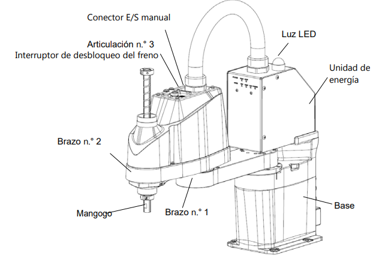
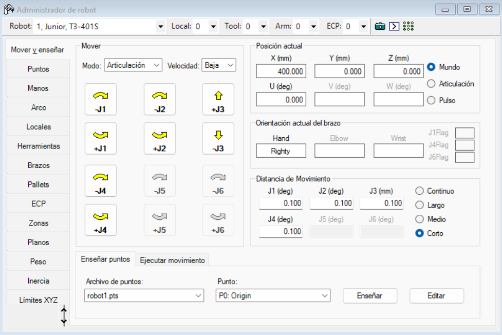
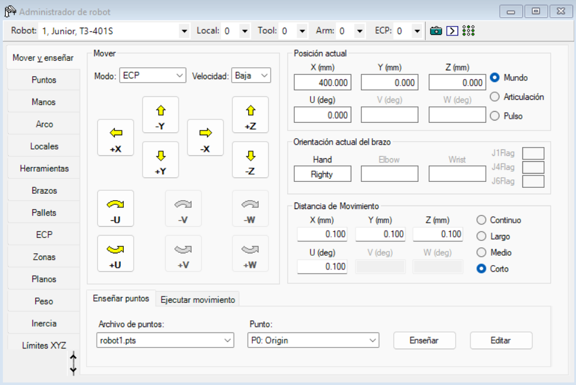

# Laboratorio No. 03 — Robótica Industrial
### Análisis y Operación del Manipulador EPSON T3-401S.
**Universidad Nacional de Colombia · Robótica 2026-I**

---

## Integrantes

| Nombre | URL del Repositorio |
|--------|-------------------|
| Julian Benitez | https://github.com/JulianI3 |
| Juan Salamanca | https://github.com/JuanSalan |

---

## Descripción de la Solución

En este laboratorio se trabajó con el simulador EPSON RC+ 7.0 para la programación y validación de tareas de manipulación utilizando el robot SCARA EPSON T3-401S. Mediante el desarrollo de un programa en lenguaje SPEL+, se implementó una estrategia de paletizado para el transporte de dos huevos en una cubeta, empleando un manipulador neumático como elemento de agarre. Para definir la secuencia de posiciones de depósito, se generó un pallet basado en el recorrido del caballo en ajedrez, garantizando que los huevos fueran ubicados en posiciones diferentes sin repetir casillas previamente ocupadas. La solución fue validada en el entorno de simulación, permitiendo verificar el correcto funcionamiento de las rutinas de pick-and-place.

---
## Tabla comparativa de especificaciones entre robot manipulador Motoman MH6 y IRB 140

La siguiente tabla muestra las características técnicas de los 3 Robots manipuladores utilizados en los últimos laboratorios
<table align="center">
  <tr>
    <th align="center">Característica</th>
    <th align="center">Motoman MH6</th>
    <th align="center">IRB 140</th>
    <th align="center">EPSON T3-401S</th>
  </tr>

  <tr>
    <td align="center">Fabricante</td>
    <td align="center">Yaskawa Motoman</td>
    <td align="center">ABB</td>
    <td align="center">EPSON</td>
  </tr>

  <tr>
    <td align="center">Controlador</td>
    <td align="center">DX100</td>
    <td align="center">IRC5</td>
    <td align="center">Controlador integrado T3 (EPSON RC+ 7.0)</td>
  </tr>

  <tr>
    <td align="center">Carga útil</td>
    <td align="center">6 kg</td>
    <td align="center">6 kg</td>
    <td align="center">3 kg</td>
  </tr>

  <tr>
    <td align="center">Alcance</td>
    <td align="center">1422 mm</td>
    <td align="center">800 mm</td>
    <td align="center">400 mm</td>
  </tr>

  <tr>
    <td align="center">Número de grados de libertad</td>
    <td align="center">6</td>
    <td align="center">6</td>
    <td align="center">4</td>
  </tr>

  <tr>
    <td align="center">Peso</td>
    <td align="center">130 kg</td>
    <td align="center">98 kg</td>
    <td align="center">16 kg</td>
  </tr>

  <tr>
    <td align="center">Repetibilidad</td>
    <td align="center">±0,08 mm</td>
    <td align="center">±0,08 mm</td>
    <td align="center">±0,02 mm</td>
  </tr>

  <tr>
    <td align="center">Velocidad eje S / A / 1</td>
    <td align="center">140 °/s</td>
    <td align="center">200 °/s</td>
    <td align="center">3,7 m/s</td>
  </tr>

  <tr>
    <td align="center">Velocidad eje L / B / 2</td>
    <td align="center">130 °/s</td>
    <td align="center">200 °/s</td>
    <td align="center">3,7 m/s</td>
  </tr>

  <tr>
    <td align="center">Velocidad eje U / C / 3</td>
    <td align="center">135 °/s</td>
    <td align="center">260 °/s</td>
    <td align="center">1,0 m/s</td>
  </tr>

  <tr>
    <td align="center">Velocidad eje R / D / 4</td>
    <td align="center">270 °/s</td>
    <td align="center">360 °/s</td>
    <td align="center">260 °/s</td>
  </tr>

  <tr>
    <td align="center">Velocidad eje B / E / 5</td>
    <td align="center">270 °/s</td>
    <td align="center">360 °/s</td>
    <td align="center">N.A.</td>
  </tr>

  <tr>
    <td align="center">Velocidad eje T / F / 6</td>
    <td align="center">400 °/s</td>
    <td align="center">450 °/s</td>
    <td align="center">N.A.</td>
  </tr>

  <tr>
    <td align="center">Aplicaciones típicas</td>
    <td align="center">Soldadura por arco, corte y manipulación de materiales</td>
    <td align="center">Ensamblaje de precisión, pick and place y educación</td>
    <td align="center">Pick and place, ensamblaje, clasificación, manipulación de pequeñas piezas y automatización de laboratorio</td>
  </tr>
</table>

<table>
<tr>
<td align="center">

 
<b>(a)</b> Notación de ejes para el manipulador Motoman MH6
</td>

<td align="center">

 
<b>(b)</b> Notación de ejes para el manipulador IRB 140
</td>

<td align="center">

 
<b>(c)</b> Notación de ejes para el manipulador EPSON T3-401S
</td>

</tr>
</table>

---
### Configuración HOME del robot EPSON T3-401S

La configuración **HOME** define la posición de referencia del robot EPSON T3-401S, la cual es utilizada como punto seguro para el inicio y finalización de tareas, recuperación ante errores y procedimientos de calibración. Esta configuración se establece desde el entorno de programación **EPSON RC+ 7.0** y se define mediante los valores de posición de cada articulación medidos en pulsos de codificador (*encoder pulses*).

En la práctica realizada, la posición HOME fue configurada con los siguientes valores:

| Articulación | Posición HOME |
| ------------ | ------------: |
| J1           | 204800 pulsos |
| J2           |      0 pulsos |
| J3           |      0 pulsos |
| J4           |      0 pulsos |

Las articulaciones del robot corresponden a los siguientes movimientos:

* **J1:** rotación de la base del robot alrededor del eje vertical.
* **J2:** rotación del brazo principal.
* **J3:** desplazamiento vertical del eje prismático.
* **J4:** rotación de la herramienta o efector final.

Adicionalmente, el sistema permite definir el orden en que cada articulación se desplaza durante el retorno a HOME. Para esta configuración se estableció el siguiente esquema:

| Articulación | Orden de movimiento |
| ------------ | ------------------- |
| J1           | Paso 2              |
| J2           | Paso 2              |
| J3           | Paso 1              |
| J4           | Paso 2              |

De acuerdo con esta configuración, el eje vertical (**J3**) se desplaza primero hasta alcanzar su posición de referencia. Posteriormente, las articulaciones **J1**, **J2** y **J4** realizan el movimiento hacia sus respectivas posiciones HOME. Esta estrategia permite incrementar la seguridad operacional del sistema, ya que el efector final se eleva antes de ejecutar desplazamientos horizontales o movimientos de orientación, reduciendo la probabilidad de colisiones con piezas, herramientas o elementos del entorno de trabajo.

---
### Movimientos manuales del robot EPSON T3-401S en EPSON RC+ 7.0

La pestaña **Mover y enseñar** de EPSON RC+ 7.0 permite realizar el control manual del robot EPSON T3-401S para tareas de enseñanza de puntos, verificación de trayectorias y posicionamiento del efector final. Desde esta interfaz es posible operar el manipulador tanto en coordenadas articulares como en coordenadas cartesianas, además de visualizar en tiempo real la posición actual del robot y configurar la magnitud de cada desplazamiento.

Para realizar movimientos manuales, inicialmente se debe seleccionar el modo de operación en el menú **Modo**. El software ofrece dos alternativas principales:

* **Articulación:** permite controlar individualmente cada eje del robot.
* **Cartesiano (Mundo):** permite controlar directamente la posición del efector final respecto al sistema de referencia global.

#### Movimiento en modo articulación

Al seleccionar el modo Articulación, se habilitan los controles correspondientes a los ejes del robot:

    

* **J1:** rotación de la base.
* **J2:** rotación del brazo principal.
* **J3:** desplazamiento vertical.
* **J4:** rotación de la herramienta.

El movimiento se realiza mediante los botones de incremento y decremento asociados a cada articulación. Cada pulsación produce un desplazamiento de magnitud definida por el tamaño de paso seleccionado, mientras que manteniendo presionado el botón puede obtenerse un movimiento continuo.

#### Movimiento en modo cartesiano

Al seleccionar el modo cartesiano, los controles permiten desplazar el efector final directamente en el espacio de trabajo. En este modo pueden realizarse:

    

* Traslaciones sobre el eje **X**.
* Traslaciones sobre el eje **Y**.
* Traslaciones sobre el eje **Z**.
* Rotaciones alrededor del eje **U**, correspondiente a la orientación de la herramienta.

Este modo resulta especialmente útil para posicionar el efector final respecto a objetos o estaciones de trabajo sin necesidad de manipular individualmente cada articulación.

#### Lectura de posición

La interfaz muestra permanentemente la posición actual del robot, permitiendo visualizarla en diferentes sistemas de referencia:

* **Mundo (World):** coordenadas cartesianas globales del efector final.
* **Articulación (Joint):** posición individual de cada eje.
* **Pulso (Pulse):** valores internos del controlador expresados en pulsos de codificador.

Esta funcionalidad facilita la enseñanza de puntos y la verificación de configuraciones específicas del manipulador.

#### Configuración del tamaño de paso

EPSON RC+ permite seleccionar la distancia recorrida en cada movimiento manual mediante cuatro niveles de desplazamiento:

* **Corto:** 0,1 unidades (mm o grados).
* **Medio:** 1 unidad (mm o grado).
* **Largo:** 10 unidades (mm o grados).
* **Continuo:** movimiento constante mientras se mantenga presionado el control correspondiente.

Finalmente, la velocidad de movimiento puede ajustarse mediante el selector de velocidad disponible en la interfaz, permitiendo realizar operaciones de enseñanza de forma segura y controlada.

---
### Niveles de velocidad para movimientos manuales

EPSON RC+ 7.0 permite realizar movimientos manuales del robot mediante dos niveles de velocidad: "Baja (Low)" y "Alta (High)". Estos niveles determinan la rapidez con la que el manipulador responde a las órdenes de desplazamiento ejecutadas desde la pestaña **Mover y enseñar**, tanto en modo articular como cartesiano.

El nivel "Baja" está orientado a tareas de programación, enseñanza de puntos y verificación de trayectorias. Debido a la menor velocidad de desplazamiento, el operador dispone de un mayor control sobre los movimientos del robot, lo que facilita la realización de ajustes precisos y reduce los riesgos asociados a errores de programación o posicionamiento.

Por su parte, el nivel "Alta" permite efectuar desplazamientos manuales más rápidos dentro del espacio de trabajo. Este modo resulta útil cuando se requiere recorrer distancias relativamente grandes durante las etapas de configuración o validación de una aplicación, disminuyendo el tiempo necesario para posicionar el manipulador.

El cambio entre niveles de velocidad puede realizarse directamente desde la interfaz de EPSON RC+ 7.0. En la pestaña "Mover y enseñar" se encuentra el selector Velocidad, el cual permite elegir entre los modos "Baja" y "Alta". 

La identificación del nivel activo se realiza observando el valor mostrado en el campo "Velocidad" de la ventana de movimiento manual. El modo seleccionado permanece activo hasta que el usuario lo modifique nuevamente, aplicándose a todos los movimientos ejecutados desde la interfaz de enseñanza.

## Diagrama de flujo 

##  Flujo principal del código:
[Diagrama de flujo principal](Diagramas-Imágenes/flujo_principal_robot.png)

##  Flujo del movimiento ventosa:
[Diagrama de flujo ventosas](Diagramas-Imágenes/detalle_ciclo_movimiento_huevo.png)
