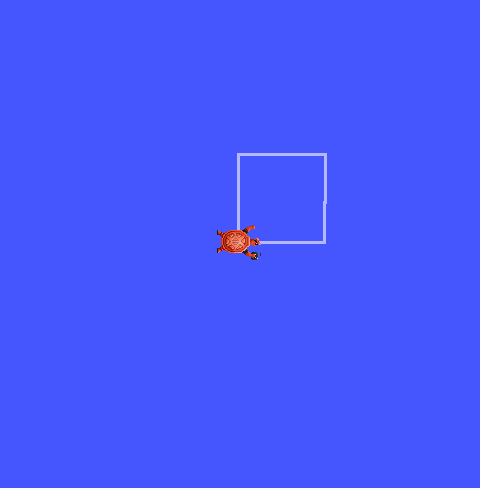

# Laboratorio No. 04 — Robótica de Desarrollo
###  Intro a ROS2 Jazzy Jalisco - Turtlesim.
**Universidad Nacional de Colombia · Robótica 2026-I**

---

## Integrantes

| Nombre | URL del Repositorio |
|--------|-------------------|
| Julian Benitez | https://github.com/JulianI3 |
| Juan Salamanca | https://github.com/JuanSalan |

---

## Descripción de la Solución

En este laboratorio se desarrolla un sistema de control para el simulador turtlesim utilizando ROS 2 Jazzy Jalisco y el lenguaje de programación Python. El objetivo principal es aplicar los conceptos básicos de comunicación mediante nodos, tópicos y servicios para controlar el movimiento de una tortuga tanto de forma manual como automática.

Inicialmente se implementa el control de velocidad lineal y angular mediante el teclado, permitiendo el desplazamiento de la tortuga en distintas direcciones. Posteriormente, se incorporan funciones modulares para ejecutar trayectorias automáticas, dibujar figuras geométricas y representar las iniciales de los integrantes del grupo. Adicionalmente, se implementan acciones complementarias como el reinicio de la simulación, la activación o desactivación del lápiz de dibujo y la detención del movimiento.

Finalmente, se desarrolla un sistema líder-seguidor conformado por dos tortugas, en el cual una segunda tortuga sigue automáticamente la trayectoria de la primera mediante el intercambio de información a través de tópicos de ROS 2 y el cálculo de la posición y orientación relativas entre ambas.

---

## Explicación del control manual de la tortuga

## Explicación de las funciones automáticas implementadas
El nodo incorpora un conjunto de funciones automáticas que permiten ejecutar movimientos predefinidos y acciones complementarias sin necesidad de controlar continuamente la tortuga mediante el teclado. Cada función fue implementada de manera modular para facilitar su mantenimiento y reutilización.

### mover(linear, angular, tiempo)

Esta función constituye la base de todas las trayectorias automáticas. Recibe como parámetros la velocidad lineal, la velocidad angular y el tiempo durante el cual deben mantenerse dichas velocidades. Durante el intervalo especificado actualiza continuamente las variables de control que posteriormente son publicadas por el temporizador en el tópico /turtle1/cmd_vel. Al finalizar el tiempo de ejecución, la función detiene completamente la tortuga.

### orientar(angulo_objetivo)

Permite orientar la tortuga hacia un ángulo absoluto específico utilizando la orientación medida por el tópico /turtle1/pose. En lugar de girar durante un tiempo fijo, calcula continuamente el error angular entre la orientación actual y la deseada, ajustando la velocidad angular de forma proporcional hasta que el error sea suficientemente pequeño. Esto proporciona una orientación considerablemente más precisa para el dibujo de figuras.

### dibujar_cuadrado()

Genera automáticamente un cuadrado mediante cuatro desplazamientos rectilíneos de igual longitud. Después de completar cada lado, la orientación de la tortuga se corrige utilizando la función orientar(), realizando un giro absoluto de 90° respecto a la orientación inicial del dibujo. Este método reduce la acumulación de errores ocasionada por giros basados únicamente en el tiempo.

<td align="center">
  
   
  <b>(b)</b> Cuadrado dibujado por la tortuga
</td>

---

## Explicación del dibujo de letras personalizadas

---

## Explicación del sistema líder-seguidor con dos tortugas

---

## Descripción de los nodos, tópicos y servicios utilizados
