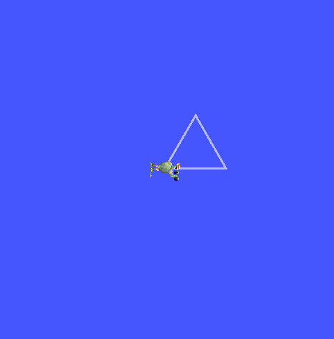
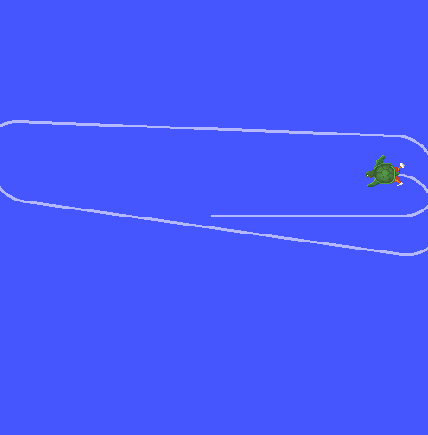
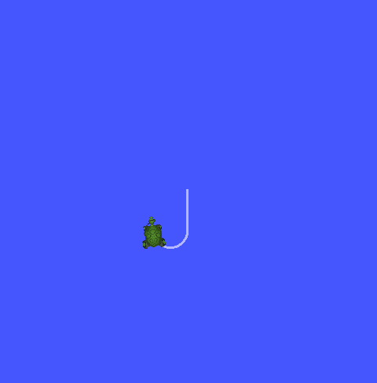
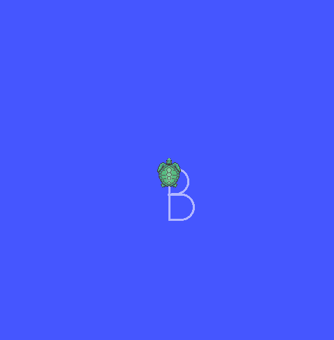
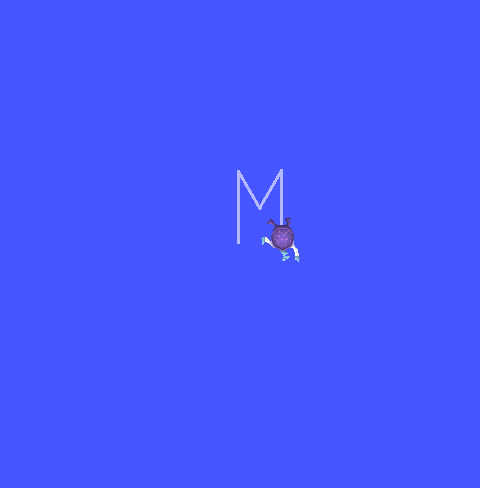
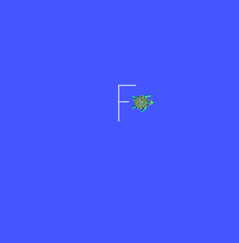
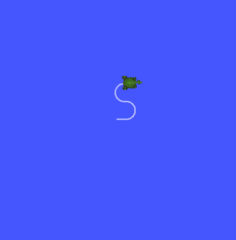
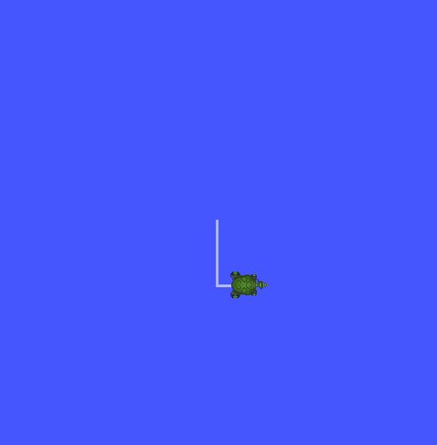
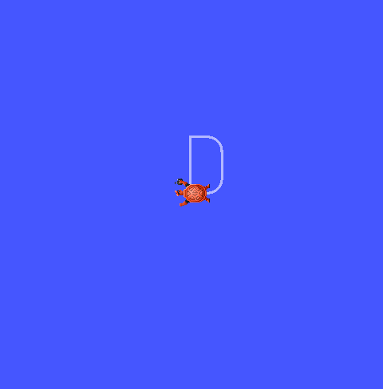
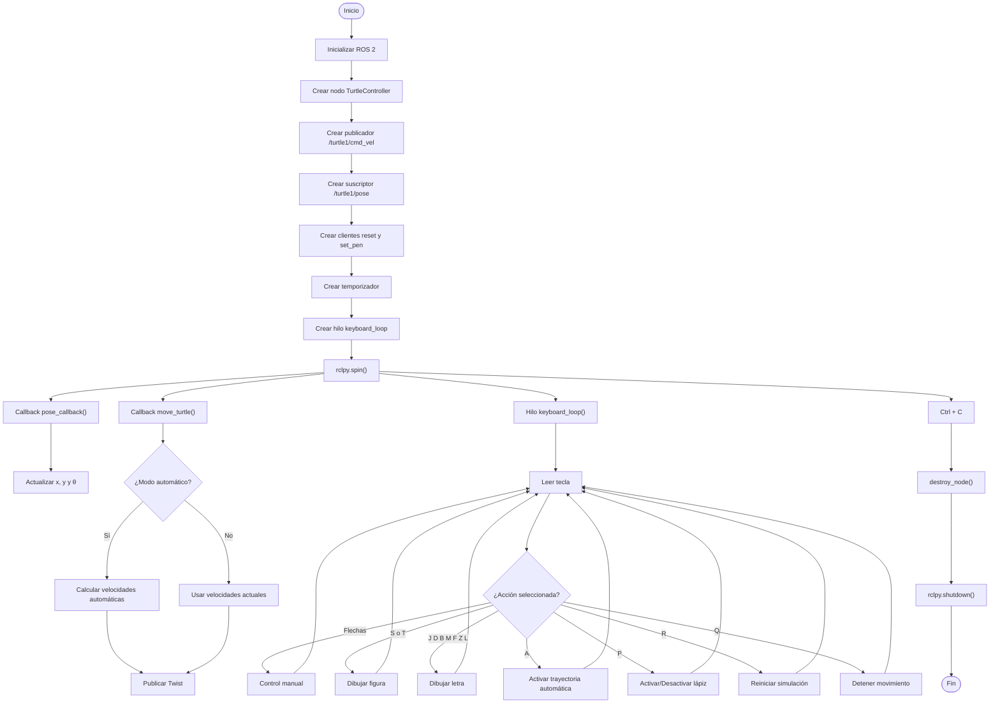

# Laboratorio No. 04 — Robótica de Desarrollo
###  Intro a ROS2 Jazzy Jalisco - Turtlesim.
**Universidad Nacional de Colombia · Robótica 2026-I**

---

## Integrantes

| Nombre | URL del Repositorio |
|--------|-------------------|
| Julian Benitez | https://github.com/JulianI3 |
| Juan Salamanca | https://github.com/JuanSalan |

---

## Descripción de la Solución

En este laboratorio se desarrolla un sistema de control para el simulador turtlesim utilizando ROS 2 Jazzy Jalisco y el lenguaje de programación Python. El objetivo principal es aplicar los conceptos básicos de comunicación mediante nodos, tópicos y servicios para controlar el movimiento de una tortuga tanto de forma manual como automática.

Inicialmente se implementa el control de velocidad lineal y angular mediante el teclado, permitiendo el desplazamiento de la tortuga en distintas direcciones. Posteriormente, se incorporan funciones modulares para ejecutar trayectorias automáticas, dibujar figuras geométricas y representar las iniciales de los integrantes del grupo. Adicionalmente, se implementan acciones complementarias como el reinicio de la simulación, la activación o desactivación del lápiz de dibujo y la detención del movimiento.

Finalmente, se desarrolla un sistema líder-seguidor conformado por dos tortugas, en el cual una segunda tortuga sigue automáticamente la trayectoria de la primera mediante el intercambio de información a través de tópicos de ROS 2 y el cálculo de la posición y orientación relativas entre ambas.

---

## Explicación del control manual de la tortuga

## Explicación de las funciones automáticas implementadas
El nodo incorpora un conjunto de funciones automáticas que permiten ejecutar movimientos predefinidos y acciones complementarias sin necesidad de controlar continuamente la tortuga mediante el teclado. Cada función fue implementada de manera modular para facilitar su mantenimiento y reutilización.

### mover(linear, angular, tiempo)

Esta función constituye la base de todas las trayectorias automáticas. Recibe como parámetros la velocidad lineal, la velocidad angular y el tiempo durante el cual deben mantenerse dichas velocidades. Durante el intervalo especificado actualiza continuamente las variables de control que posteriormente son publicadas por el temporizador en el tópico /turtle1/cmd_vel. Al finalizar el tiempo de ejecución, la función detiene completamente la tortuga.

### orientar(angulo_objetivo)

Permite orientar la tortuga hacia un ángulo absoluto específico utilizando la orientación medida por el tópico /turtle1/pose. En lugar de girar durante un tiempo fijo, calcula continuamente el error angular entre la orientación actual y la deseada, ajustando la velocidad angular de forma proporcional hasta que el error sea suficientemente pequeño. Esto proporciona una orientación considerablemente más precisa para el dibujo de figuras.

### dibujar_cuadrado()

Genera automáticamente un cuadrado mediante cuatro desplazamientos rectilíneos de igual longitud. Después de completar cada lado, la orientación de la tortuga se corrige utilizando la función orientar(), realizando un giro absoluto de 90° respecto a la orientación inicial del dibujo.

    

### dibujar_triangulo()

Implementa el dibujo de un triángulo equilátero. La función realiza tres desplazamientos rectos de igual longitud y, al finalizar cada lado, utiliza orientar() para establecer la siguiente orientación, separada 120° de la anterior. 

    

### reiniciar()

Realiza una llamada al servicio /reset de turtlesim, restaurando la simulación a su estado inicial. Como resultado, la tortuga vuelve a la posición central con orientación inicial y se elimina cualquier trazo previamente dibujado.

### cambiar_lapiz()

Permite activar o desactivar el lápiz de dibujo mediante el servicio /turtle1/set_pen. La función conserva internamente el estado del lápiz (pen_on) para alternar entre ambas condiciones cada vez que el usuario presiona la tecla correspondiente. 

### detener()

Detiene inmediatamente cualquier trayectoria automática en ejecución. Para ello desactiva el modo automático, establece en cero las velocidades lineal y angular e indica a las funciones de movimiento que finalicen su ejecución mediante la variable stop_requested.

### trayectoria_automatica()

Activa un modo de navegación autónoma en el que la tortuga avanza continuamente por el escenario. Cuando detecta que se aproxima a alguno de los límites de la ventana de turtlesim, modifica automáticamente su velocidad angular para cambiar de dirección y evitar salir del área de trabajo. Este comportamiento se ejecuta de manera continua dentro de la función move_turtle().

    

### move_turtle()

Corresponde a la función ejecutada periódicamente por el temporizador del nodo. Su responsabilidad es construir y publicar el mensaje Twist con las velocidades lineal y angular actuales hacia el tópico /turtle1/cmd_vel. Cuando el modo automático está habilitado, también calcula los cambios de dirección necesarios para evitar que la tortuga alcance los límites del entorno de simulación. De esta manera, actúa como el lazo principal de control encargado de enviar continuamente los comandos de movimiento a la tortuga.

---

## Explicación del dibujo de letras personalizadas

### Dibujo de la letra J 

Al presionar la tecla J, la tortuga se orienta inicialmente hacia abajo para garantizar que la letra siempre conserve la misma orientación, independientemente de la dirección en la que se encontraba previamente. A continuación, recorre el tramo vertical principal y finaliza realizando un movimiento curvo equivalente a un gancho mediante la combinación de velocidad lineal y velocidad angular, reproduciendo la forma característica de la letra.

    

### Dibujo de la letra B

La letra B se activa mediante la tecla B. Primero, la tortuga se orienta hacia el eje positivo de X y realiza un pequeño desplazamiento horizontal. Posteriormente dibuja el lóbulo superior mediante una media circunferencia, avanza hasta la zona central y repite el procedimiento para formar el lóbulo inferior. Finalmente se orienta hacia arriba y completa la barra vertical, obteniendo una representación continua de la letra.

    

### Dibujo de la letra M

Al presionar la tecla M, la tortuga comienza orientándose verticalmente para dibujar el primer segmento recto. Luego modifica sucesivamente su orientación para generar las dos diagonales internas mediante movimientos lineales y concluye con el último segmento vertical, formando la estructura característica de la letra M.

    

### Dibujo de la letra F

La letra F se ejecuta con la tecla F. Inicialmente se dibuja la barra vertical principal y posteriormente la barra superior. Para evitar que aparezcan líneas no deseadas durante el reposicionamiento hacia la mitad de la letra, el lápiz se desactiva temporalmente utilizando el servicio SetPen. Una vez alcanzada la posición adecuada, el lápiz vuelve a activarse y se dibuja la barra horizontal central.

    

### Dibujo de la letra S

Debido a que la tecla S ya se encuentra asignada al dibujo automático del cuadrado, la letra S se ejecuta mediante la tecla Z. La trayectoria comienza con un pequeño tramo recto superior, seguido de una media circunferencia, un breve enlace lineal y una segunda media circunferencia en sentido contrario. Finalmente se añade un pequeño tramo recto inferior para completar la forma de la letra.

    

### Dibujo de la letra L

Al presionar la tecla L, la tortuga se orienta hacia abajo y dibuja la barra vertical de la letra mediante un movimiento rectilíneo. Posteriormente gira hacia la derecha y realiza un desplazamiento horizontal para formar la base, obteniendo una representación simple de la letra L.

    

### Dibujo de la letra D 

La letra D se activa mediante la tecla D. La tortuga comienza dibujando la barra vertical, avanza ligeramente en la parte superior y genera el borde curvo derecho mediante dos cuartos de circunferencia unidos por un segmento vertical. Finalmente se orienta hacia la izquierda para cerrar la base de la letra con un último movimiento rectilíneo. 

    

---

## Explicación del sistema líder-seguidor con dos tortugas

---

## Descripción de los nodos, tópicos y servicios utilizados

La implementación del laboratorio utiliza un único nodo desarrollado en Python denominado turtle_controller, el cual se encarga de gestionar el control manual de la tortuga, la ejecución de trayectorias automáticas, el dibujo de figuras y letras, así como la interacción con los diferentes mecanismos de comunicación proporcionados por ROS 2.

### Nodo
#### turtle_controller: 
Su función es leer las entradas del teclado, calcular las velocidades de movimiento, publicar comandos de velocidad, recibir la posición de la tortuga y solicitar servicios para reiniciar la simulación o modificar el estado del lápiz.

### Tópicos
#### /turtle1/cmd_vel (Publisher)
Tópico de tipo geometry_msgs/Twist utilizado para enviar comandos de velocidad lineal y angular a la tortuga. Es el principal medio de control del movimiento durante la operación manual y automática.

#### /turtle1/pose (Subscriber)
Tópico de tipo turtlesim/Pose empleado para recibir continuamente la posición (x,y) y la orientación (θ) de la tortuga. Esta información se utiliza para conocer el estado actual del robot, orientar correctamente las figuras y letras, y ejecutar la trayectoria automática.

### Servicios

#### /reset (Servicio std_srvs/Empty)
Reinicia la simulación de turtlesim, devolviendo la tortuga a su posición inicial y eliminando todos los trazos realizados.

#### /turtle1/set_pen (Servicio turtlesim/SetPen)
Permite modificar las propiedades del lápiz de dibujo, incluyendo el color RGB, el grosor de la línea y el estado del lápiz (activado o desactivado). Esta funcionalidad se emplea tanto para habilitar o deshabilitar el dibujo como para realizar desplazamientos sin dejar rastro durante la construcción de algunas letras.

---

## Diagramas de flujo

